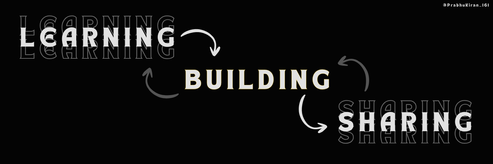

# Hello Devs, I'm Prabhu Kiran 👋

  

# About Me 

I'm a passionate **Software Development Engineer** with **2+ years** of experience in **Web & Mobile Application** development, integrating **AI** to create innovative solutions. I thrive on solving complex problems, exploring new technologies, and collaborating on impactful projects.  

# Skills

<table align="center" width="500">
  <tr width="500">
    <td align="center" colspan="2" width="500" height="100" rowspan="2">
      <strong>Programming Languages</strong> 
      
    </td>    
  </tr>
  <tr>
    <td align="center" colspan="2" width="500" height="100">
      <strong>Frameworks & Libraries</strong> 
      
    </td>
  </tr>
  <tr>
    <td align="center" colspan="2" width="500" height="100" rowspan="2">
      <strong>Databases & Cloud</strong> 
      
    </td>    
  </tr>
  <tr>
    <td align="center" colspan="2" width="500" height="100">
      <strong>Development Workflow</strong> 
      
    </td>
  </tr>
  <tr>
    <td align="center" colspan="4" width="500" height="100" rowspan="2">
      <strong>DevOps & Infrastructure</strong> 
      
    </td>
  </tr>
</table>

